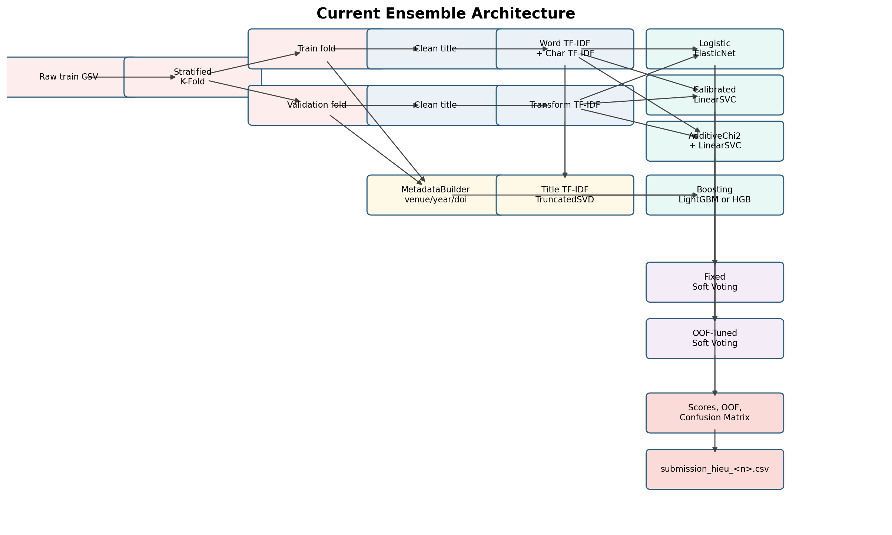
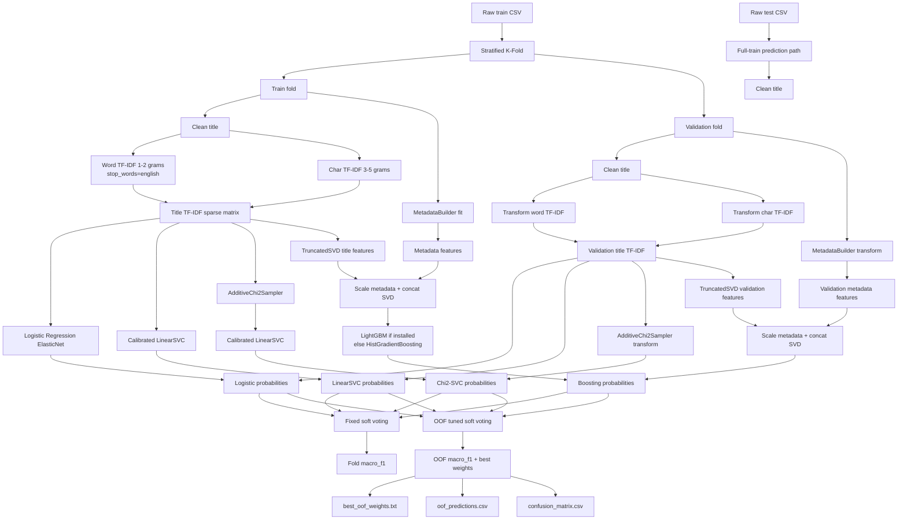
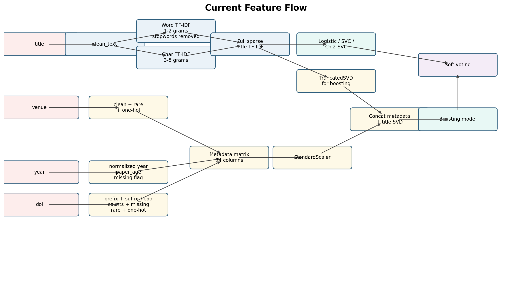
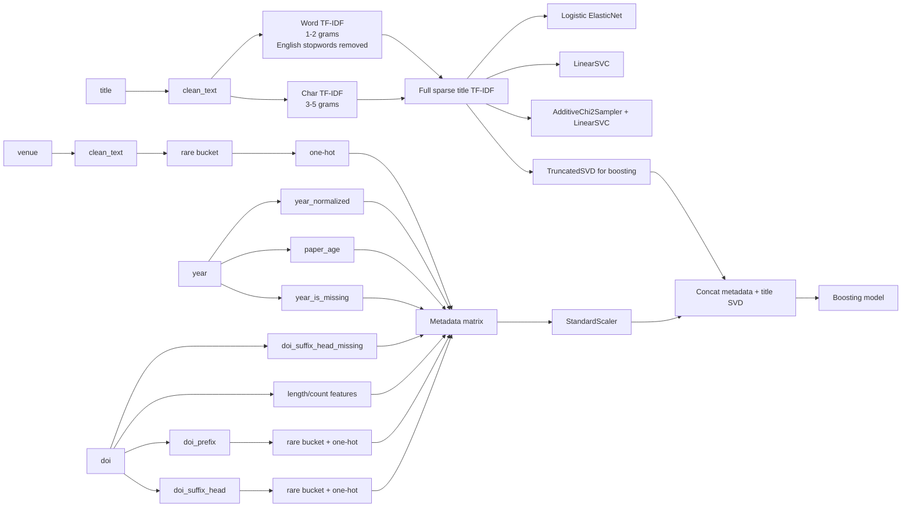

# Current Ensemble Workflow

## Status Check

The current pipeline includes the requested core parts:

- `title` text cleaning before TF-IDF.
- Word TF-IDF with English stopword removal.
- Character TF-IDF kept without stopword removal.
- Additive Chi-square kernel approximation for a title-only SVM branch.
- Metadata features from `venue`, `year`, and `doi`; `authors` is kept for preview only.
- DOI split into `doi_prefix` and `doi_suffix_head`.
- Soft voting with fixed weights.
- OOF-tuned soft voting that searches weights by validation `macro_f1`.
- Numbered submission output as `submission_hieu_<number>.csv`.

Current feature sizes from the latest preview:

```text
cleaned_text_preview: 510 rows x 12 columns
metadata_features:    510 rows x 74 columns
title_tfidf:          510 rows x 17365 columns
title_tfidf_nonzero:  84230 non-zero values
```

Latest tuned OOF weights:

```text
logistic_elasticnet: 0.85
calibrated_linear_svc: 0.00
chi2_linear_svc: 0.00
boosting: 0.15
```

Interpretation: the architecture has the Chi2 kernel branch, but the latest OOF tuning does not give it weight yet. Logistic title TF-IDF remains the main model, while the metadata/SVD boosting branch contributes a small amount.

## Architecture

Rendered PNG:





## Feature Flow

Rendered PNG:





## Current Feature Coverage

The current feature set is enough for a solid first ensemble experiment:

- Strong title branch: full sparse TF-IDF into Logistic/SVC.
- Kernel-style title branch: `AdditiveChi2Sampler + LinearSVC`.
- Metadata branch: compact venue/year/DOI features plus title SVD into boosting.
- DOI has both publisher-level signal and suffix/event-like signal.
- Missingness is represented for `year` and DOI suffix head.

The main limitation is not missing feature coverage, but model contribution: the latest OOF tuning still trusts mostly Logistic. That means the next useful work is not adding many more raw features, but improving the non-Logistic branches until they add real diversity.

## Next Checks

- Try `rare_threshold` values `2`, `3`, `5`, and `10`.
- Try Logistic Hybrid: full title TF-IDF plus metadata one-hot/numeric features.
- Tune `C` for `LinearSVC` and `chi2_linear_svc`.
- Compare stopword removal on/off because it changed the Logistic score.
- Install real LightGBM/XGBoost/CatBoost if the environment supports them.
