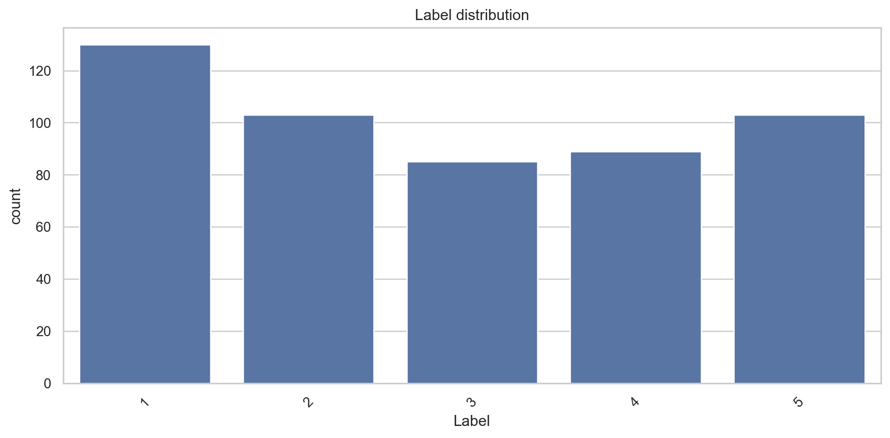
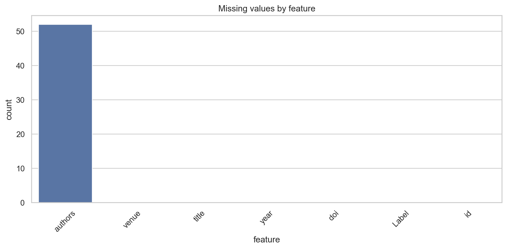
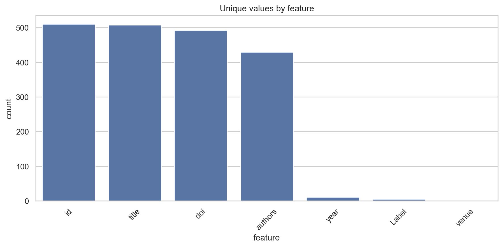
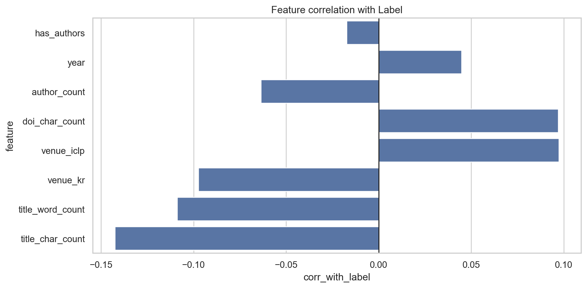
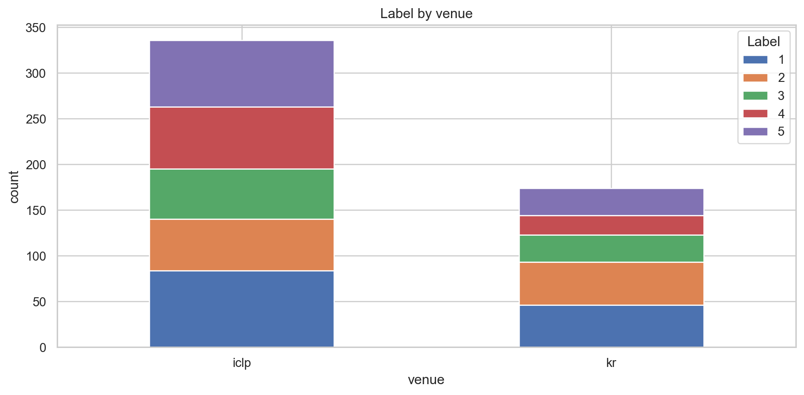
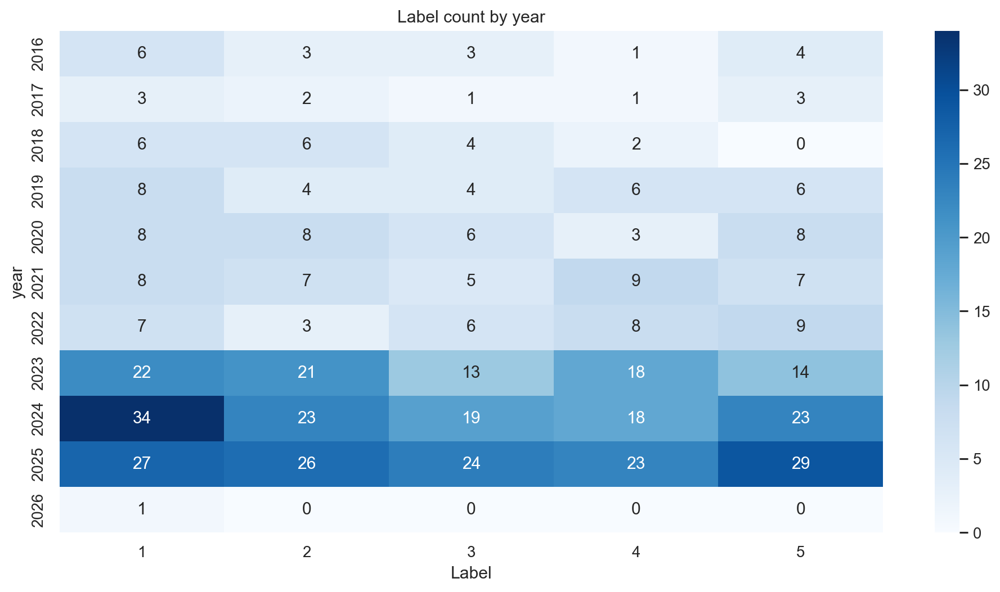

# EDA Report

- Dataset: `C:\project\asp-paper-classification\dataset_stage1\Stage_1_publcitrain.csv`
- Shape: 510 rows x 7 columns
- Features used, excluding `Label` and `id`: title, venue, year, authors, doi
- Duplicated rows: 0

## Label distribution



```
   Label  count    percent
0      1    130  25.490196
1      2    103  20.196078
2      3     85  16.666667
3      4     89  17.450980
4      5    103  20.196078
```

## Feature overview





```
         dtype  count_non_null  missing  missing_percent  unique
title      str             510        0         0.000000     508
venue      str             510        0         0.000000       2
year     int64             510        0         0.000000      11
authors    str             458       52        10.196078     429
doi        str             510        0         0.000000     492
Label    int64             510        0         0.000000       5
id       int64             510        0         0.000000     510
```

## Original numeric std

```
year    2.476999
```

## Correlation with Label



```
            feature  corr_with_label
0  title_char_count        -0.142417
1  title_word_count        -0.108814
2          venue_kr        -0.097341
3        venue_iclp         0.097341
4    doi_char_count         0.096927
5      author_count        -0.063675
6              year         0.044695
7       has_authors        -0.017238
8           has_doi              NaN
```

## Label by venue



```
Label    1    2   3   4    5  All
venue                            
iclp    84   56  55  68   73  336
kr      46   47  30  21   30  174
All    130  103  85  89  103  510
```

## Label by year



```
Label    1    2   3   4    5  All
year                             
2016     6    3   3   1    4   17
2017     3    2   1   1    3   10
2018     6    6   4   2    0   18
2019     8    4   4   6    6   28
2020     8    8   6   3    8   33
2021     8    7   5   9    7   36
2022     7    3   6   8    9   33
2023    22   21  13  18   14   88
2024    34   23  19  18   23  117
2025    27   26  24  23   29  129
2026     1    0   0   0    0    1
All    130  103  85  89  103  510
```

## Plot files

- `eda_outputs/plots/01_label_distribution.png`
- `eda_outputs/plots/02_missing_values_by_feature.png`
- `eda_outputs/plots/03_unique_values_by_feature.png`
- `eda_outputs/plots/04_venue_distribution.png`
- `eda_outputs/plots/05_year_distribution.png`
- `eda_outputs/plots/06_label_by_venue_stacked_bar.png`
- `eda_outputs/plots/07_label_by_year_heatmap.png`
- `eda_outputs/plots/08_feature_corr_with_label.png`
- `eda_outputs/plots/09_engineered_feature_correlation_heatmap.png`
- `eda_outputs/plots/10_engineered_feature_covariance_heatmap.png`
- `eda_outputs/plots/11_engineered_feature_std.png`
- `eda_outputs/plots/12_year_by_label_boxplot.png`
- `eda_outputs/plots/13_title_char_count_by_label_boxplot.png`
- `eda_outputs/plots/14_title_word_count_by_label_boxplot.png`
- `eda_outputs/plots/15_author_count_by_label_boxplot.png`
- `eda_outputs/plots/16_doi_char_count_by_label_boxplot.png`

## Output files

- `feature_overview.csv`: dtype, non-null count, missing, unique values
- `label_distribution.csv`: so luong tung Label
- `std_original_numeric.csv`, `cov_original_numeric.csv`: std/cov cua feature numeric goc
- `std_engineered_features.csv`, `cov_engineered_features.csv`: std/cov sau khi tao feature tu text/category
- `feature_corr_with_label.csv`: tuong quan tung feature voi Label
- `label_by_venue_count.csv`, `label_by_year_count.csv`: quan he venue/year voi Label
- `numeric_features_by_label.csv`: mean/std/min/max cua feature numeric theo tung Label