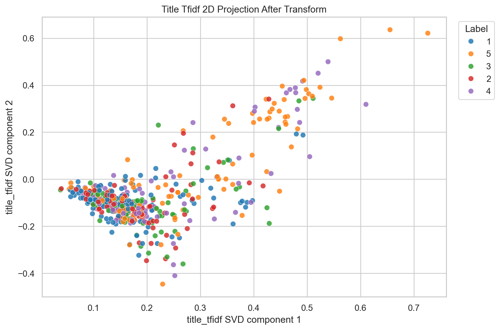
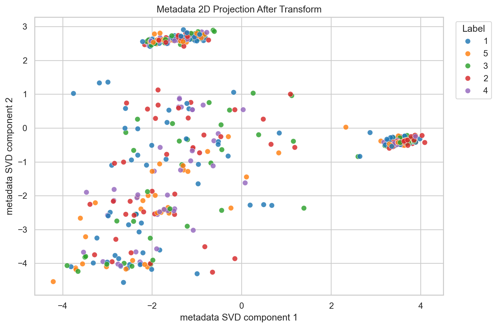
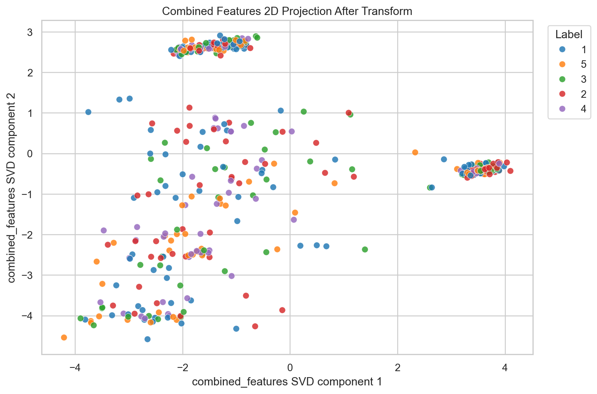
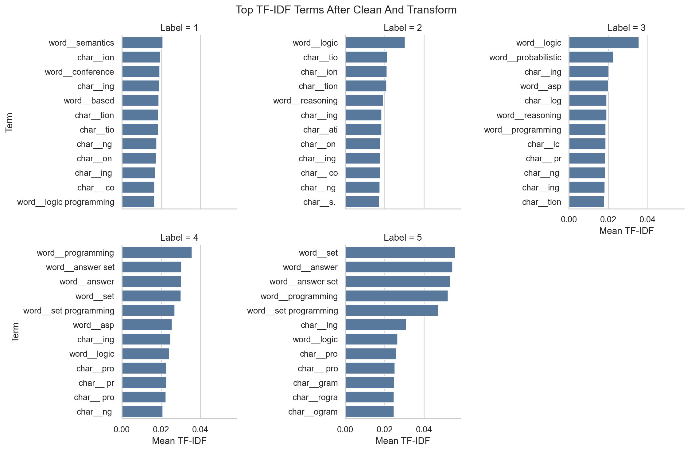

# Transformed Feature Visualization

## Goal

Visualize features after cleaning/transformation and before classifier fitting, colored by `Label`.

## Transform Steps

- Cleaned text fields with the same `clean_text` function used in the ensemble pipeline.
- Built fold-style metadata features with `MetadataBuilder` on the full train set for visualization.
- Built title TF-IDF with word 1-2 grams and char 3-5 grams.
- Used TruncatedSVD only for visualization because TF-IDF is high-dimensional.

## Main Plots

## Generated Files

- `cleaned_feature_preview.csv`: cleaned title, venue, DOI and label.
- `transformed_metadata_features.csv`: metadata features after engineering.
- `title_tfidf_svd_projection.csv`: 2D SVD coordinates from title TF-IDF.
- `metadata_svd_projection.csv`: 2D SVD coordinates from metadata features.
- `combined_features_svd_projection.csv`: 2D SVD coordinates from metadata plus title SVD.
- `top_tfidf_terms_by_label.csv`: strongest mean TF-IDF terms per label.

## Plot Files

- `C:/project/asp-paper-classification/soi_vng/feature_visualizations/plots/title_tfidf_svd_by_label.png`
- `C:/project/asp-paper-classification/soi_vng/feature_visualizations/plots/metadata_svd_by_label.png`
- `C:/project/asp-paper-classification/soi_vng/feature_visualizations/plots/combined_features_svd_by_label.png`
- `C:/project/asp-paper-classification/soi_vng/feature_visualizations/plots/top_tfidf_terms_by_label.png`
- `C:/project/asp-paper-classification/soi_vng/feature_visualizations/plots/boxplot_title_word_count_by_label.png`
- `C:/project/asp-paper-classification/soi_vng/feature_visualizations/plots/boxplot_title_char_count_by_label.png`
- `C:/project/asp-paper-classification/soi_vng/feature_visualizations/plots/boxplot_title_avg_word_length_by_label.png`
- `C:/project/asp-paper-classification/soi_vng/feature_visualizations/plots/boxplot_doi_length_by_label.png`
- `C:/project/asp-paper-classification/soi_vng/feature_visualizations/plots/boxplot_doi_digit_count_by_label.png`
- `C:/project/asp-paper-classification/soi_vng/feature_visualizations/plots/boxplot_doi_slash_count_by_label.png`
- `C:/project/asp-paper-classification/soi_vng/feature_visualizations/plots/boxplot_doi_dot_count_by_label.png`
- `C:/project/asp-paper-classification/soi_vng/feature_visualizations/plots/boxplot_year_normalized_by_label.png`
- `C:/project/asp-paper-classification/soi_vng/feature_visualizations/plots/boxplot_paper_age_by_label.png`